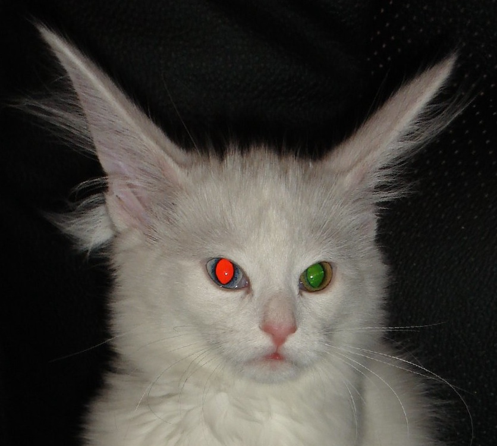
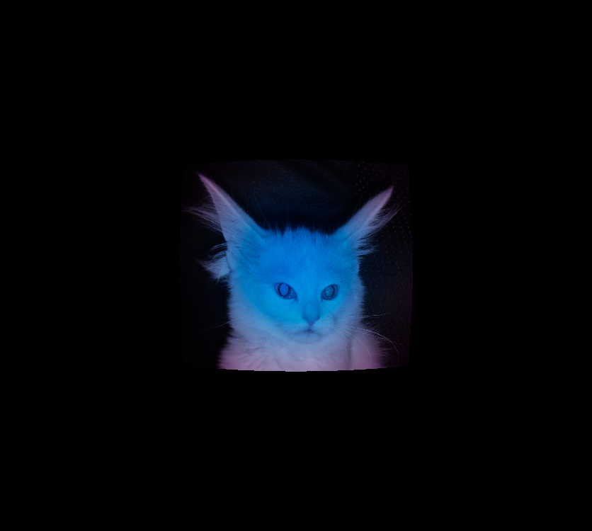

# Relativistic Image Transformer

Simulates what a printed picture would look like when approached at near-light speed.
| Original | v = 0.7 c |
|---|---|
|  |  |

## Effects

- **Relativistic aberration** -- image compressed into a forward cone
- **Relativistic Doppler shift** -- spectral color change via Gaussian basis reconstruction
- **Searchlight effect** -- D^5 brightness scaling (center bright, edges dark)
- **Spectral redistribution** -- UV/IR crossover (visible light shifts to UV, IR shifts into visible)

## Usage

```
python relativistic_transform.py img.jpg                          # defaults: beta=0.5, FOV=60
python relativistic_transform.py img.jpg -b 0.9 --debug           # high speed + debug plots
python relativistic_transform.py img.jpg -b 0.3 -o out.png        # moderate speed
python relativistic_transform.py img.jpg -b 0.99 --tone-map log   # extreme speed
```

### Arguments

| Argument       | Default    | Description                              |
|----------------|------------|------------------------------------------|
| `input`        | (required) | Path to input image                      |
| `-o, --output` | auto       | Output path (`<stem>_relativistic.png`)  |
| `-b, --beta`   | 0.5        | Velocity as fraction of c, in [0, 1)     |
| `--fov`        | 60.0       | Horizontal field of view in degrees       |
| `--exposure`   | auto       | Manual exposure value                     |
| `--tone-map`   | reinhard   | Tone mapping: `reinhard`, `log`, `clamp` |
| `--debug`      | off        | Show matplotlib debug visualisation       |

## Dependencies

NumPy, SciPy, Pillow. Optional: Matplotlib (for `--debug`).

## Known Limitations

- **Doppler factor range**: The precomputed spectral colour matrices cover D values from 0.05 to 30.0. At extreme velocities (beta > ~0.998), the centre Doppler factor exceeds this range and is clamped, which produces incorrect colours. Edge pixels are similarly affected for beta > ~0.99. For reliable results, keep beta below 0.99.
